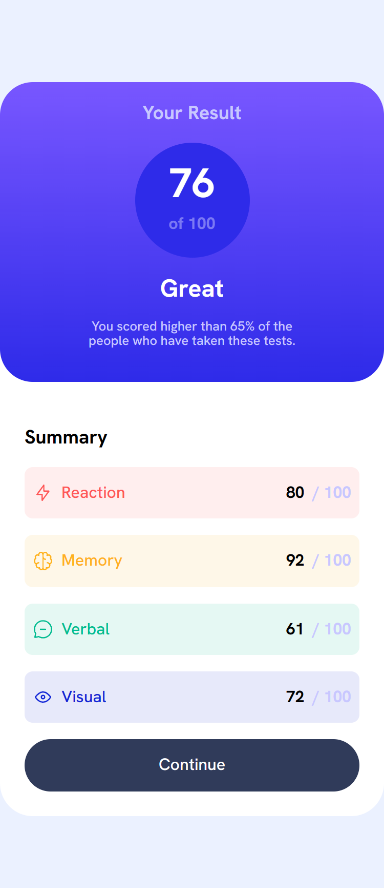
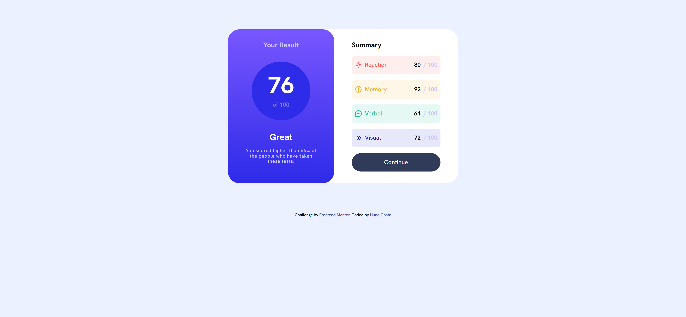

# Frontend Mentor - Results summary component solution

This is a solution to the [Results summary component challenge on Frontend Mentor](https://www.frontendmentor.io/challenges/results-summary-component-CE_K6s0maV). Frontend Mentor challenges help you improve your coding skills by building realistic projects.

## Table of contents

- [Overview](#overview)
  - [The challenge](#the-challenge)
  - [Screenshot](#screenshot)
  - [Links](#links)
- [My process](#my-process)
  - [Built with](#built-with)
  - [What I learned](#what-i-learned)
- [Author](#author)

## Overview

### The challenge

Users should be able to:

- View the optimal layout for the interface depending on their device's screen size
- See hover and focus states for all interactive elements on the page
- **Bonus**: Use the local JSON data to dynamically populate the content

### Screenshot

<h4 align="center"><strong>Desktop Design</strong></h4>

<p align="center">


<h4 align="center"><strong>Mobile Design</strong></h4>

<p align="center">


### Links

- Solution URL: [Frontend Mentor Solution URL](https://github.com/Bottom17/results-summary-component-challenge)
- Live Site URL: [Live site URL](https://bottom17.github.io/results-summary-component-challenge/)

## My process

### Built with

- Semantic HTML5 markup
- Flexbox
- Mobile-first workflow

### What I learned

Thanks to this project I learned how to use Flexbox. Not only that, this project allowed me to fully understand its key concept.

Furthermore, to make the Website populate content based of the local JSON file data I had to search more about the fetch function. Thanks to this function we can extract data from the JSON file, and based on the data received the Website displays different information.

```js
fetch("../src/data.json")
  .then(function (response) {
    return response.json();
  })
  .then(function (data) {
    appendData(data);
  })
  .catch(function (err) {
    const averageScoreElement = document.querySelector(
      ".app__result-circle-total"
    );
    averageScoreElement.innerHTML += 0;
    console.log("error: " + err);
  });
```

## Author

- Frontend Mentor - [@Bottom17](https://www.frontendmentor.io/profile/Bottom17)
